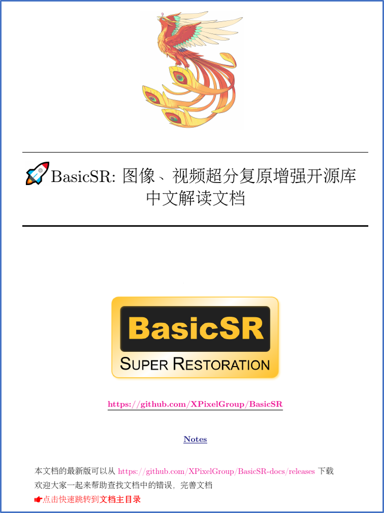

# BasicSR 中文解读文档

这是 [BasicSR](https://github.com/XPixelGroup/BasicSR) 的中文解读文档。

⏬ 本文档的最新版可以从 [releases](https://github.com/XPixelGroup/BasicSR-docs/releases) 下载。

## 欢迎贡献

😊 欢迎大家一起来帮助查找文档中的错误，完善文档。

- 文档风格的约定：[doc_style.md](doc_style.md)

## Release

- 当设置 tags 并 push 后，会触发 [release 流程](https://github.com/XPixelGroup/BasicSR-docs/blob/master/.github/workflows/release.yml)
- 触发 GitHub workflow 后，会进行 LaTex 自动编译，并构建一个 release draft
- 修改 release draft，进行正式 release

## 📜 License and Acknowledgement

The LaTex template is modified from <https://arxiv.org/abs/2201.09746>
